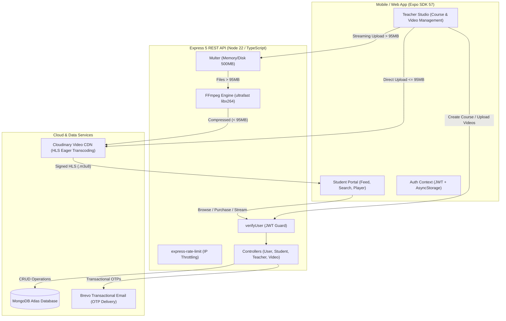

# 🎓 Full-Stack LMS (Learning Management System)

A production-grade, full-stack Learning Management System featuring a cross-platform mobile client (React Native / Expo), an enterprise-ready containerized Express backend, adaptive HTTP Live Streaming (HLS) with Cloudinary, real-time video upload pipeline with automated compression, and role-based workflows for Students and Teachers.

---

## 📑 Table of Contents

- [Overview & Architecture](#-overview--architecture)
- [Key Features](#-key-features)
  - [Student Experience](#student-experience)
  - [Teacher Studio](#teacher-studio)
  - [Video Pipeline & Streaming Architecture](#video-pipeline--streaming-architecture)
  - [Security & Authentication](#security--authentication)
- [Tech Stack](#-tech-stack)
- [Directory Structure](#-directory-structure)
- [API Reference](#-api-reference)
  - [Authentication & User (`/user`)](#authentication--user-user)
  - [Student Routes (`/student`)](#student-routes-student)
  - [Teacher Routes (`/teacher`)](#teacher-routes-teacher)
  - [Video Playback (`/videos`)](#video-playback-videos)
- [Environment Variables](#-environment-variables)
- [Getting Started](#-getting-started)
  - [Prerequisites](#prerequisites)
  - [Backend Setup](#backend-setup)
  - [Frontend Setup](#frontend-setup)
- [Docker & Production Deployment](#-docker--production-deployment)
- [Troubleshooting & FAQs](#-troubleshooting--faqs)

---

## 🏗 Overview & Architecture

The application is structured into two main tiers:
1. **Frontend (`/Frontend`)**: An Expo (SDK 57) + React Native mobile application supporting iOS, Android, and Web, powered by Expo Router, Reanimated, and native video player modules.
2. **Backend (`/Backend`)**: A TypeScript Express 5 service running in a Debian Slim container equipped with FFmpeg, connecting to MongoDB Atlas, Cloudinary CDN, and Brevo (Sendinblue) transactional email.



---

## ✨ Key Features

### Student Experience
- **Interactive Feed & Search**: Browse published courses with dynamic category tags, pricing indicators, and real-time title/keyword filtering.
- **Course Details & Preview**: View syllabus, instructor credentials, course outline, duration, and enrollment metrics before purchasing.
- **Instant Enrollment**: One-click simulated purchase workflow linking transactions directly to enrolled student profiles.
- **"My Learning" Dashboard**: Centralized tab displaying all purchased courses with immediate resume playback.
- **Adaptive HLS Video Player**: Custom video player built on `expo-video` supporting multi-bitrate HLS streams (`.m3u8`), auto-adjusting resolution to the student's network bandwidth.

### Teacher Studio
- **Dedicated Dashboard**: Teachers access a customized workspace showcasing their published courses, total enrolled students, and total revenue.
- **Course Authoring**: Create, update, or remove courses complete with titles, descriptions, pricing (up to ₹50,000), and cover art.
- **Lesson Management**: Organize lessons sequentially with custom `orderInCourse` numbering, titles, and descriptions.
- **Real-Time Upload Feedback**: Live visual upload progress bar tracking the exact percentage and status while transferring heavy video files.

### Video Pipeline & Streaming Architecture
- **500 MB File Size Cap**: Teachers can upload video assets up to **500 MB** directly from their devices.
- **Smart Dual-Route Ingestion**:
  1. **Direct Signed Upload ($\le 95\text{ MB}$)**: Client requests a cryptographic signature from `/teacher/video/signature` and streams the video directly to Cloudinary's authenticated CDN, saving backend server bandwidth.
  2. **Server-Side FFmpeg Compression ($> 95\text{ MB}$)**: Files exceeding 95MB bypass Cloudinary's 100MB Nginx body ceiling and stream to the backend. The server automatically compresses the video to $\le 92\text{ MB}$ using FFmpeg (`-preset ultrafast`, `-tune fastdecode`, `-vf scale=-2:720`, `-pix_fmt yuv420p`) before dispatching to Cloudinary, ensuring zero quota rejections even on Cloudinary Free Tier accounts.
- **Paywall Protection & Signed Delivery**: Video assets are stored with `type: authenticated` and `sp_hd/m3u8` eager profiles. Playback links are signed dynamically on-demand with short TTLs (`SIGNED_URL_TTL_SECONDS = 3600`), preventing link sharing or direct access without active enrollment.

### Security & Authentication
- **Secure Signup with OTP Verification**: Account registration generates 6-digit numeric OTPs dispatched via Brevo email API. OTPs are hashed using SHA-256 before database storage; plaintexts are never persisted.
- **Rate-Limiting & Brute-Force Defense**: Strict IP-based rate limiting on sensitive authentication routes (`/user/login`, `/user/sendOtp`, `/user/customSignup`) prevents automated credential attacks.
- **Role-Based Access Control (RBAC)**: Enforces strict separation between `"student"` and `"teacher"` roles across endpoints and mobile navigation tabs.
- **Zero Orphaned Files**: Automatic cleanup hooks scrub temporary disk assets upon completion or unexpected pipeline failures.

---

## 🛠 Tech Stack

### Frontend (Mobile & Web)
| Technology | Version / Description |
| :--- | :--- |
| **React Native** | `0.86.3` / Core mobile runtime |
| **Expo SDK** | `~57.0.24` / Unified cross-platform app framework |
| **Expo Router** | `~57.0.22` / File-system based routing and deep linking |
| **TypeScript** | Strict type-safety across all screens, hooks, and services |
| **Expo Video** | Hardware-accelerated adaptive video playback module |
| **React Native Reanimated** | Smooth 60fps animations and transitions |
| **AsyncStorage** | Encrypted/persistent local token and setting storage |

### Backend (Server & Media)
| Technology | Version / Description |
| :--- | :--- |
| **Node.js** | `Node 22 (LTS)` |
| **Express** | `5.2.1` / Fast, modern HTTP server |
| **MongoDB & Mongoose** | `9.9.1` / Document database with indexing and schemas |
| **Fluent-FFmpeg** | `2.1.3` / Programmatic video transcoding and duration probing |
| **Multer** | Multipart form handling with 500MB upload limits |
| **Cloudinary SDK** | `2.10.1` / Chunked video ingestion and HLS transformations |
| **JSON Web Tokens (JWT)** | Stateless bearer token authentication |
| **Express Rate Limit** | `8.6.2` / IP-based request throttling |

---

## 📁 Directory Structure

```text
LMS/
├── render.yaml                   # Infrastructure as Code: Render Blueprint deploy spec
├── README.md                     # Project documentation
│
├── Backend/
│   ├── Dockerfile                # Multi-stage Docker build (Debian Slim + FFmpeg)
│   ├── package.json              # Backend dependencies and scripts
│   ├── tsconfig.json             # TypeScript configuration
│   └── src/
│       ├── app.ts                # Express app initialization, middleware, routes
│       ├── index.ts              # Entry point: DB connection & HTTP listener
│       ├── config/
│       │   └── cloudinary.ts     # Cloudinary SDK credentials configuration
│       ├── controllers/
│       │   ├── userController.ts     # Signup, OTP verification, Login, Profile
│       │   ├── studentController.ts  # Feed, search, course details, purchase
│       │   ├── teacherController.ts  # Course CRUD, stats
│       │   └── videoController.ts    # Signatures, chunked uploads, FFmpeg compression
│       ├── database/
│       │   └── dbConnection.ts   # MongoDB Mongoose connection handler
│       ├── middlewares/
│       │   ├── authMiddleware.ts # JWT verification & role authorization
│       │   ├── errorMiddleware.ts# Centralized error handler
│       │   ├── multerMiddleware.ts# File upload bounds (500MB cap)
│       │   └── rateLimiters.ts   # Rate-limiting policies
│       ├── models/
│       │   ├── userModel.ts      # User schema, OTP schema, password schema
│       │   ├── courseModel.ts    # Course schema with owner reference
│       │   ├── videoModel.ts     # Video metadata, publicId, and sequencing
│       │   └── transactionModel.ts# Student enrollment purchase records
│       ├── routes/
│       │   ├── userRouter.ts     # /user endpoints
│       │   ├── studentRouter.ts  # /student endpoints
│       │   ├── teacherRouter.ts  # /teacher endpoints
│       │   └── videoRouter.ts    # /videos endpoints
│       └── utils/
│           ├── apiError.ts       # Structured HTTP error helper
│           ├── asyncHandler.ts   # Async route wrapper
│           ├── cloudinaryUploader.ts # upload_large, signed HLS URLs
│           ├── jwtokengenerator.ts   # JWT issuance
│           ├── sendOtp.ts        # Brevo transactional email sender
│           └── videoEncoding.ts  # FFmpeg duration probe & ultrafast compressor
│
└── Frontend/
    ├── app.json                  # Expo project metadata & icon configuration
    ├── package.json              # Frontend dependencies and scripts
    ├── tsconfig.json             # TypeScript config
    └── src/
        ├── app/
        │   ├── _layout.tsx       # Root layout with AuthProvider & Toast host
        │   ├── index.tsx         # Splash / entry redirector
        │   ├── profileupdation.tsx# Edit profile information screen
        │   ├── (auth)/
        │   │   ├── Login.tsx     # Student & Teacher login screen
        │   │   └── Signup.tsx    # Multi-role registration & OTP screen
        │   ├── (tabs)/
        │   │   ├── _layout.tsx   # Role-conditional bottom tab navigator
        │   │   ├── explore.tsx   # Course exploration feed (Student)
        │   │   ├── learning.tsx  # Enrolled courses (Student)
        │   │   ├── teacher.tsx   # Course management dashboard (Teacher)
        │   │   └── profile.tsx   # User profile, avatar change, settings
        │   ├── detailspage/      # Course syllabus & enrollment checkout
        │   ├── homepage/         # Landing feed
        │   ├── teacher/
        │   │   ├── createCourse.tsx # Create/publish new course modal
        │   │   └── uploadVideo.tsx  # 500MB video uploader with live progress
        │   └── videoplayer/      # Adaptive HLS player screen
        ├── components/
        │   ├── Card.tsx          # Course presentation card
        │   ├── FilterCard.tsx    # Category chips
        │   ├── OtpInput.tsx      # 6-digit split OTP input boxes
        │   ├── Skeleton.tsx      # Shimmer loading placeholders
        │   └── Toast.tsx         # In-app notifications
        ├── context/
        │   └── AuthContext.tsx   # Global authentication state provider
        ├── services/
        │   └── api.ts            # XHR streaming uploader, token interceptors
        └── types/
            └── api.ts            # Shared TypeScript data models
```

---

## 📡 API Reference

### Authentication & User (`/user`)
| Method | Endpoint | Auth | Description |
| :--- | :--- | :---: | :--- |
| `POST` | `/user/customSignup` | ❌ | Register new account; triggers OTP email |
| `POST` | `/user/verifyOtp` | ❌ | Validate 6-digit OTP code to activate account |
| `POST` | `/user/sendOtp` | ❌ | Request new verification OTP |
| `POST` | `/user/resendOtp` | ❌ | Resend replacement OTP (rate-limited) |
| `POST` | `/user/login` | ❌ | Authenticate credentials; returns JWT token |
| `GET` | `/user/me` | ✅ | Fetch currently authenticated user profile |
| `POST` | `/user/profilePic` | ✅ | Upload user profile avatar (Cloudinary image) |
| `PUT` | `/user/profile` | ✅ | Update fullName or profile details |

### Student Routes (`/student`)
| Method | Endpoint | Auth | Description |
| :--- | :--- | :---: | :--- |
| `GET` | `/student/courses/feed` | ✅ | Retrieve paginated public course feed |
| `GET` | `/student/courses/search` | ✅ | Search courses by title, tags, or keywords |
| `GET` | `/student/courses/:courseId` | ✅ | Fetch course details with enrollment status |
| `POST` | `/student/courses/purchase` | ✅ | Enroll student into a course |

### Teacher Routes (`/teacher`)
| Method | Endpoint | Auth | Role | Description |
| :--- | :--- | :---: | :---: | :--- |
| `GET` | `/teacher/courses` | ✅ | `teacher` | List all courses owned by current teacher |
| `POST` | `/teacher/courses/create` | ✅ | `teacher` | Create a new course |
| `PUT` | `/teacher/courses/update` | ✅ | `teacher` | Modify course metadata |
| `DELETE`| `/teacher/courses/delete` | ✅ | `teacher` | Delete a course and associated records |
| `GET` | `/teacher/video/signature` | ✅ | `teacher` | Obtain Cloudinary direct signed upload params |
| `POST` | `/teacher/video/record` | ✅ | `teacher` | Index directly uploaded video in MongoDB |
| `POST` | `/teacher/video/upload` | ✅ | `teacher` | Server-side chunked upload with auto-compression |

### Video Playback (`/videos`)
| Method | Endpoint | Auth | Description |
| :--- | :--- | :---: | :--- |
| `GET` | `/videos/course/:courseId` | ✅ | List all video lessons for an enrolled course |
| `GET` | `/videos/:videoId` | ✅ | Fetch short-lived signed HLS URL (`.m3u8`) |

---

## 🔐 Environment Variables

Create a `.env` file in `Backend/` based on the following template:

```env
# Server Runtime
PORT=5002
NODE_ENV=development

# Database
MONGODB_URI=mongodb+srv://<user>:<password>@cluster0.mongodb.net/LMS?retryWrites=true&w=majority

# Authentication
JWT_SECRET=your_super_secret_jwt_key_here

# Transactional Email (Brevo / Sendinblue)
BREVO_API_KEY=xkeysib-xxxxxxxxxxxxxxxxxxxxxxxxxxxxxxxx
MAIL_SENDER_EMAIL=your-verified-sender@example.com
MAIL_SENDER_NAME=LMS Platform

# Cloudinary Storage & Streaming
CLOUDINARY_CLOUD_NAME=your_cloud_name
CLOUDINARY_API_KEY=your_api_key
CLOUDINARY_API_SECRET=your_api_secret
# Optional but strongly recommended: Token key for expiring signed HLS URLs
CLOUDINARY_AUTH_TOKEN_KEY=your_token_key_from_cloudinary_security_tab

# Cross-Origin Resource Sharing (comma-separated list for web clients)
CORS_ORIGINS=http://localhost:8081,https://your-domain.com
```

---

## 🚀 Getting Started

### Prerequisites
- [Node.js](https://nodejs.org/) (version 20 or 22 LTS)
- [npm](https://www.npmjs.com/) or [yarn](https://yarnpkg.com/)
- [Docker](https://www.docker.com/) (optional, for local container testing)
- [Expo Go](https://expo.dev/go) on your physical device or an Android / iOS Simulator
- [FFmpeg](https://ffmpeg.org/) installed locally (if running Backend outside Docker)

### Backend Setup
1. Open a terminal and navigate to the backend directory:
   ```bash
   cd Backend
   ```
2. Install dependencies:
   ```bash
   npm install
   ```
3. Populate your `.env` file with credentials.
4. Run the development server with hot-reload:
   ```bash
   npm run dev
   ```
   The server will start on `http://localhost:5002`. Verify health by visiting `http://localhost:5002/health`.

5. Type-check and build for production:
   ```bash
   npm run typecheck
   npm run build
   ```

### Frontend Setup
1. Open a terminal and navigate to the frontend directory:
   ```bash
   cd Frontend
   ```
2. Install dependencies:
   ```bash
   npm install
   ```
3. Start the Expo development server:
   ```bash
   npx expo start
   ```
4. Run on your platform of choice:
   - Press `a` for **Android Emulator**.
   - Press `i` for **iOS Simulator**.
   - Press `w` for **Web Browser**.
   - Scan the QR code with **Expo Go** on your physical Android or iPhone.

---

## 🐳 Docker & Production Deployment

### Docker Multi-Stage Build
The backend includes an optimized multi-stage `Dockerfile`:
- **Build Stage**: Runs on `node:22-bookworm-slim`, compiles TypeScript, and resolves path aliases.
- **Runtime Stage**: Installs system `ffmpeg` and `ca-certificates`, strips dev dependencies, runs under a dedicated unprivileged `node` user, and exposes `/health` with an automated healthcheck.

To build and run locally with Docker:
```bash
cd Backend
docker build -t lms-backend .
docker run -p 5002:5002 --env-file .env lms-backend
```

### Render Deployment (`render.yaml`)
A ready-to-use Render Blueprint is included in the project root:
1. Connect your repository to [Render](https://render.com).
2. Choose **New > Blueprint** and select this repository.
3. Render automatically provisions the web service in Singapore using `./Backend/Dockerfile`.
4. Enter the required secret environment variables (`MONGODB_URI`, `JWT_SECRET`, `BREVO_API_KEY`, `CLOUDINARY_*`) in the Render Dashboard.

---

## ❓ Troubleshooting & FAQs

#### 1. Why are long video uploads failing with a timeout?
The application implements streaming `uploadFileWithXHR` with `timeout = 0`. Standard fetch or native `FileSystem.uploadAsync` has a hardcoded 60s OkHttp socket limit on Android. Streaming XHR bypasses this restriction and supports long uploads up to 500 MB.

#### 2. Why did Cloudinary return `413 Request Entity Too Large`?
Cloudinary's public direct endpoint (`api.cloudinary.com`) is fronted by an Nginx reverse proxy that rejects unchunked payloads $> 100\text{ MB}$. In this project:
- Videos $\le 95\text{ MB}$ use the direct signed pipeline.
- Videos $> 95\text{ MB}$ are automatically redirected to the backend chunked pipeline, where they are compressed to $\le 92\text{ MB}$ and uploaded via `upload_large` with 6MB chunks.

#### 3. How do I enable expiring playback URLs?
In the Cloudinary console, navigate to **Settings > Security > Token-based Authentication**, generate a token key, and copy it into `CLOUDINARY_AUTH_TOKEN_KEY` in your backend environment.

#### 4. The Render free-tier backend takes ~45 seconds on the first request.
Render free-tier instances sleep after 15 minutes of inactivity. When woken up, cold starts take approximately 30–50 seconds. The frontend's `apiRequest` timeout has been calibrated to 60–90 seconds to handle cold starts gracefully.

---

## 📄 License

This project is licensed under the ISC License.
